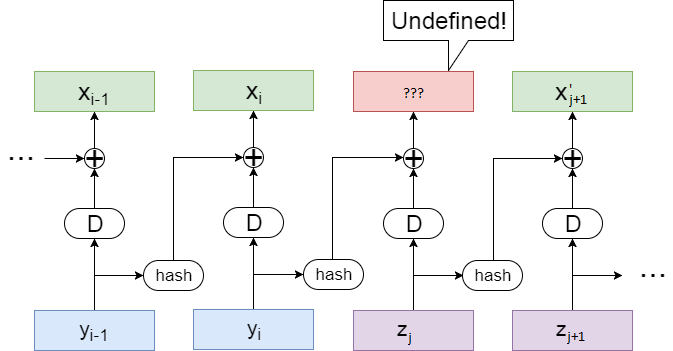
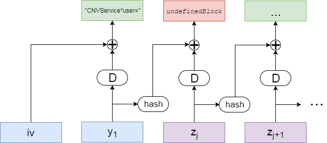
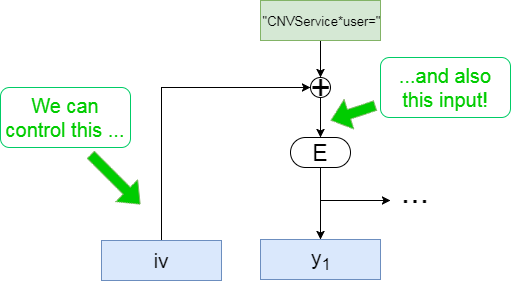
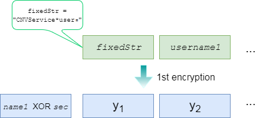
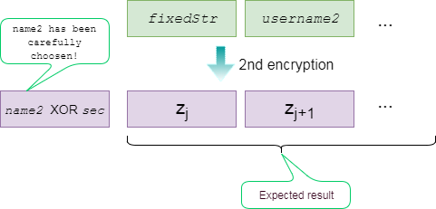
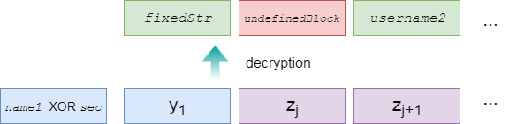

## Writeup for _Acebear Security Contest 1/2018_
### (Crypto challenge) _CNV Service_
#### Tóm tắt đề bài
Cho dịch vụ tại _cnvservice.acebear.site:1337_ gồm 2 lựa chọn như sau:
- _Register_: Người dùng gửi lên `name` và `username`, server trả về bản mã của cookie là một chuỗi văn bản có các trường phân cách bởi ký tự `*` như sau: `cookie = "CNVService" + "*" + "user="+ username + "*" + ctime() + "*" + __SECRET__`, sử dụng thuật toán mã khối AES với khóa ngẫu nhiên cho mỗi phiên kết nối, chế độ làm việc CBC với hash (xem cụ thể hình bên dưới), padding PKCS7, véc-tơ khởi tạo `iv = (pad(name) XOR hash(__HIDDEN__))`. `__HIDDEN__`, `__SECRET__` là các đoạn văn bản bí mật phía server. Người dùng được phép tạo 2 cookie trong một phiên kết nối với điều kiện: `"root" not in username`.
- _Login_: Người dùng gửi lên bản mã của cookie. Sau khi giải mã, server sẽ trả về **_FLAG_** nếu:
  + Trường đầu là `CNVService`
  + Trường cuối là `__SECRET__`
  + Trường thứ hai là `user=root`

Sơ đồ mã hóa:

  

#### Ý tưởng giải quyết

Đây là dạng bài về mã khối hết sức quen thuộc. Những người chơi có kinh nghiệm biết chắc hướng đi sẽ là gán ghép các khối bản mã thu được từ 2 cookie hợp lệ (`"root" not in username`) thành một bản mã của cookie có thể vượt qua các kiểm tra phía server. Việc gán ghép đối với các khối bản mã trong chế độ CBC sẽ cho hiệu ứng tại vị trí gán ghép như sau:

  

Ta sẽ gài khối mã không xác định này vào vị trí chứa `username`. Để ý thấy độ dài chuỗi `"CNVService*user="` vừa bằng kích thước một khối (16), như vậy `undefinedBlock` sẽ rơi vào vị trí số 2. Nhiệm vụ còn lại là lựa chọn các giá trị đầu vào phù hợp sao cho phía server giải mã `undefinedBlock` thành `root*...`


#### Tính toán các số liệu
Tình huống hiện tại:

  

Ta có `undefinedBlock = hash(y1) XOR D(zj)`. Nếu rút `y1` theo `zj`, ta được:
```
y1 = unhash(undefinedBlock XOR D(zj))
```
Việc tính `y1` từ `zj` có vẻ không khả thi bởi ta phải tìm ánh xạ ngược của hàm hash (trong trường hợp này là MD5) và hàm giải mã D (thuật toán AES). Thử rút `zj` theo `y1`:
```
zj = E(undefinedBlock XOR hash(y1))
```
Lựa chọn này có vẻ khả thi hơn bởi ta không cần phải thực hiện `unhash`. Mặt khác, việc mã hóa có thể lợi dụng server để thực hiện. Nếu để ý đề bài, ta có `iv = pad(name) XOR hash(__HIDDEN__)`. Như vậy, ta hoàn toàn có thể kiếm soát được giá trị đầu vào bộ mã hóa `E` thông qua giá trị `name`.

  

Định hướng thực hiện như sau:
1. Gửi bất kì 2 giá trị `name1` và `username1` lên server, chẳng hạn: `name1 = username1 = 'a'*16`. Có thể gửi ngắn hơn `BLOCK_SIZE` nhưng cần chú ý đến hiệu ứng padding cho `name1`.
2. Nhận về `iv1`, `y1`, `y2`,... Trong đó `iv1 = name1 XOR sec` với `sec = hash(__HIDDEN__)`. Suy ra `sec = iv1 XOR name1`.

  

3. Chọn `undefinedBlock = "root*" + 'a'*11`. Sau đó tính `input2 = undefinedBlock XOR hash(y1)`, mục đích là để `E(input2) = E(undefinedBlock XOR hash(y1)) = zj`. Tiếp tục tính giá trị `name2` để có được `input2` như trên:  
Ta có: `input2 = iv2 XOR fixedStr = (name2 XOR sec) XOR fixedStr`, cho nên `name2 = input2 XOR sec XOR fixedStr` với `fixedStr = "CNVService*user="`. Giá trị `username2` có thể tùy ý: `username2 = 'a'*16`
4. Gửi lên server các chuỗi `name2`, `username2`. Nếu các tính toán là đúng, ta sẽ nhận về `iv2`, `zj`, `z[j+1]`...

  

5. Gửi `iv1`, `y1`, `zj`, `z[j+1]`... lên server. Cookie sau giải mã sẽ có dạng: `CNVService*user=` `root*aaaaaaaaaaa` `aaaaaaaaaaaaaaaa` `*Mon Jan 29 17:5` ...

  


#### Thực hiện

**_B1:_** Khởi tạo các hằng số và kết nối đến server.


```python
from mylib import *
setup("cnvservice.acebear.site", 1337)

fixedStr = "CNVService*user="
undefinedBlock = "root*When God wa" # <- meaningful words instead of aaaaaa...

connect()
```

**_B2:_** Đăng kí tài khoản với `name1`, `username1`. Nhận dữ liệu trả về, lọc lấy `iv1`, `y1`:


```python
name1 = "The GOD's father"
username1 = "This is useless!"

send('1\n')
recvUntil('Name:') # synchronizing
send(name1)
recvUntil('Username:')
send(username1)

data = recvUntil('[0-9A-Za-z/+=]{20,}')[0].decode('base64') # receive data in base64-encoding form
iv1 = data[0:16]
y1 = data[16:32]
```

**_B3:_** Tính toán, lựa chọn các giá trị `name2`, `username2` phù hợp:


```python
sec = xor(iv1, name1)
input2 = xor(undefinedBlock, hash(y1))
name2 = xor(xor(input2, sec), fixedStr)

# In case name2 is started or ended with [ \t\n\r\f\v],
# the attack will fail and you should rerun the whole script.
if (len(name2.strip()) < 16):
    print 'Failed to get flag!'
    quit()

username2 = "s born!"

# The expected cookie after decrypted would look like:
# CNVService*user=root*When GOD was born!*Mon Jan 29 17:55:07 2018*A secret message
# It will pass all the security checks
```

**_B4:_** Gửi `name2`, `username2` lên server để đăng kí tài khoản thứ hai. Lọc bỏ khối đầu tiên (`iv2`) của dữ liệu nhận về.


```python
send('1\n')
recvUntil('Name:') # synchronizing
send(name2)
recvUntil('Username:')
send(username2)

data = recvUntil('[0-9A-Za-z/+=]{20,}')[0].decode('base64') # receive data in base64-encode
data = data[16:] # this is z[j], z[j+1],...
```

**_B5:_** Gửi `iv1`, `y1`, `data` lên server để đăng nhập và lấy flag.


```python
send('2\n')
recvUntil('Cookie:') # synchronizing
send((iv1 + y1 + data).encode('base64'))
recvUntil('AceBear{.*}', silent=False)[0]
```

    **************************LOGIN SUCCESS***************************

    Welcome CNV service: The GOD's father
    Username: root
    Time register: When God was born!
    ***************************Root Servive***************************
    This is flag: AceBear{AES_CNV_is_s3cure_but_CNV_S3rvic3_i5_not_s3cure}


#### Phụ lục
Đề bài: [CNVService.rar](./CNVService.rar)  
Thư viện: [mylib.py](./mylib.py)  
Just run and get flag (python version): [CNV_Service_solution.py](./CNV_Service_solution.py)
