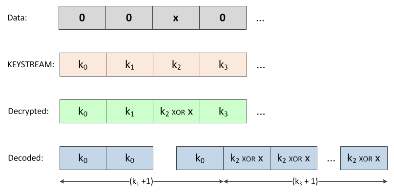
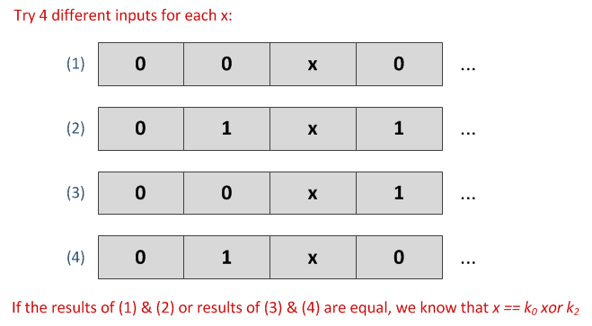
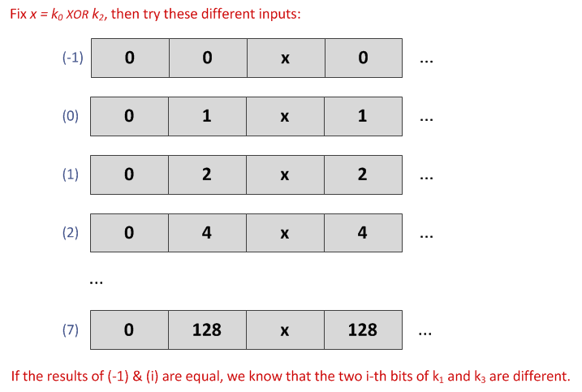
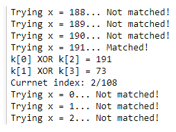
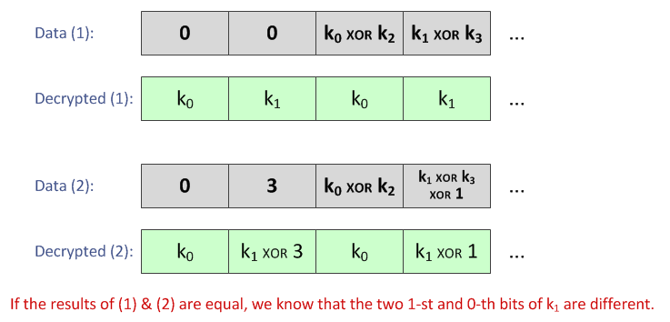

# Writeup for Google CTF 2018 Qualification Round

- Challenge: **DOGESTORE**
- By: _Nguyễn Duy Hiếu_, an undergraduate student from _ACTVN (Academy of Cryptography Techniques, Vietnam)_.
- Contact: nguyenduyhieukma@gmail.com

## Challenge summary

There's an `encrypted_secret` and a server that works as follow:

1. Receives 110-byte input.
2. Decrypts the input by xor'ing it with a fixed keystream.
3. Decodes the decrypted string by interpreting it as `"char, repeat times - 1, char, repeat times - 1, ..."`. For example, `decode("a\x00b\x01c\x02") == "abbccc"`.
4. Outputs the SHA3-256 hash of the decoded string.

## The key idea

There is more than one way to encode a string if it contains some identical consecutive characters. For example, `"aaa"` can be encoded as `"a\x02"` or `"a\x01a\x00"` or `"a\x00a\x01"` or `"a\x00a\x00a\x00"`. Knowing this fact, we could learn something about the secret keystream by examining the cases in which different inputs are fed to the server but same hash returned.

## Solution

Since the challenge's code is written in Rust which I am not used to, the basic operations of the server will be reimplemented in Python 3:

```python
KEY_SIZE = 110
KEYSTREAM = bytearray(KEY_SIZE)
def decrypt(encrypted): return bytes(a ^ b for a, b in zip(encrypted, KEYSTREAM))

def decode(encoded):
    s = b''
    for i in range(0, len(encoded), 2):
        s += bytes([encoded[i]]) * (encoded[i+1] + 1)
    return s

from hashlib import sha3_256
def hash(data): return sha3_256(data).digest()
```

Next, let's define some functions which might be useful for us:

```python
def make_data(*ivvs):
    '''This function returns 110-byte data, default to all zeros.
    User can specify some (index, value_1, value_2)'s to modify the data as needed.
    '''
    data = bytearray(110)
    for ivv in ivvs:
        data[ivv[0]] = ivv[1]
        data[ivv[0]+1] = ivv[2]
    return bytes(data)

from socket import create_connection
ADDR = ('dogestore.ctfcompetition.com', 1337)
def post(data):
    'This function posts data to the server and returns the hash received'
    while True:
        try:
            sock = create_connection(ADDR)
            sock.send(data)
            return sock.recv(4096)
        except: pass

def post_data(*ivvs): return post(make_data(*ivvs))
```

### Key leakage

#### Even-indexed bytes

Let the first 4 bytes of an input data be `0, 0, x, 0` (Figure 1). If `x == k[0] XOR k[2]` then the corresponding decypted byte `x XOR k[2]` will be `k[0]`, same as the first one, and the decrypted string will be decoded into something which has `k[1] + k[3] + 2` letter `k[0]`'s at the beginning. Now, we have a chance to modify the first and third byte of the input data (`d[0]`, `d[2]`) without changing the decoded string. If `(d[1] XOR k[1]) + (d[3] XOR k[3]) == k[1] + k[3]`, things will be as expected.

  
_Figure 1: The processing of an input with the first 4 bytes: `0, 0, x, 0`._

Recall that `a XOR 1` is equal to `a + 1` or `a - 1`, depends on the least significant bit (LSB) of `a`, so `(k[1] XOR 1) + (k[3] XOR 1) == k[1] + k[3]` if the LSB's of `k[1]` and `k[3]` are different. In case the LSB's are equal, `(k[1] XOR 1) + k[3]` must be the same as `k[1] + (k[3] XOR 1)`. Therefore, if we could find an `x` such that:
`post_data((0, 0, 0), (2, x, 0)) == post_data((0, 0, 1), (2, x, 1))` or `post_data((0, 0, 1), (2, x, 0)) == post_data((0, 0, 0), (2, x, 1))` then `x` must be equal to `k[0] XOR k[2]` (Figure 2) or, we would otherwise detect a SHA3-256 collision which seems impossible.

  
_Figure 2: `k[0] XOR k[2]` leak._

In a similar way, we could find out `k[2] XOR k[4]`, `k[4] XOR k[6]`, `k[6] XOR k[8]`,... if we want.

#### Odd-indexed bytes

Now, since `a XOR 2^i` is equal to `a + 2^i` or `a - 2^i`, depends on the i-th bit of `a`, it follows that `(a XOR 2^i) + (b XOR 2^i) == a + b` if and only if the two i-th bits of `a` and `b` are different. Using this fact, we could find out if the two i-th bits of `k[1]` and `k[3]` are equal or not for `i = 0,1,2,...,7` (Figure 3), then derive `k[1] XOR k[3]`.

  
_Figure 3: `k[1] XOR k[3]` leak._

Again, we could obtain `k[3] XOR k[5]`, `k[5] XOR k[7]`,... if we want.

#### Putting it all together

Now, connect to the server, get all `k[i] XOR k[i+2]`'s and store them in a bytearray named `DELTA`:

```python
DELTA = bytearray(KEY_SIZE - 2)
for i in range(0, len(DELTA), 2):
    print('Currnet index: {}/{}'.format(i, KEY_SIZE-2))

    # brute force x to find k[i] XOR k[i+2]
    for x in range(256):
        print('Trying x = {}... '.format(x), end='')

        _a = post_data((i, 0, 0), (i+2, x, 0))
        _b = post_data((i, 0, 1), (i+2, x, 1))
        if _a == _b:
            DELTA[i] = x
            DELTA[i + 1] = 1 # the two LSB's are different
            break

        _c = post_data((i, 0, 1), (i+2, x, 0))
        _d = post_data((i, 0, 0), (i+2, x, 1))
        if _c == _d:
            DELTA[i] = x
            DELTA[i + 1] = 0 # the two LSB's are equal
            break

        print('Not matched!')

    print('Matched!')
    print('k[{}] XOR k[{}] = {}'.format(i, i+2, x))

    # find k[i+1] XOR k[i+3]
    for j in range(1,8): # the 0-th bit (LSB) case has been done.
        _e = post_data((i, 0, 1<<j), (i+2, x, 1<<j))
        if _e == _a:
            DELTA[i + 1] |= (1<<j)

    print('k[{}] XOR k[{}] = {}'.format(i+1, i+3, DELTA[i+1]))
```

Some output from the Python 3 kernel:

  
_Figure 4: Some output from the Python 3 kernel._

The final `DELTA`:

```python
DELTA.hex()
```

    'bf49779084babcd9ab76f224215f0fd3321b002a203582c96e9f33ff391624696c5edfac848030773aaa2f1cbe9d90b73672736bfa315bf80d9310f11999c181b2c71a2573338c54e7fa412363ebb4e1ddc579cd5c29cee61081406b98f8b523e7c5e48e883a95ccb134ed15'

### Key recovery

The most important part has been done. Now, we need to recover the whole keystream in order to decrypt the `encrypted_secret`. There are multiple ways to do that but for now, let's define a function that, given `k[0]` and `k[1]`, performs `KEYSTREAM` initialization:

```python
def keystream_init(k0, k1):
    KEYSTREAM[0] = k0
    KEYSTREAM[1] = k1
    for i in range(2, KEY_SIZE):
        KEYSTREAM[i] = DELTA[i-2] ^ KEYSTREAM[i-2]
```

#### Using known patterns in plaintext

The secret contains the FLAG, which in turn contains `"CTF{"`. Therefore, `"T\x00F\x00{"` is a known pattern (notice that we do not know if there is any letter `'C'` which precedes or letter `'{'` which follows the substring `"CTF{"`).

Now, let's focus on only the letters (the even-indexed bytes of the plaintext). Despite their length, the four letters `'C'`, `'T'`, `'F'`, `'{'` must appear one after another. Using this assumption, we can guess the first byte of the keystream as follow:

```python
with open('encrypted_secret','rb') as f:
    encrypted_secret = f.read()

for k0 in range(256):
    keystream_init(k0, 0) # the second argument is not important
    letters = decrypt(encrypted_secret)[::2] # focus on even-indexed bytes
    if b'CTF{' in letters:
        break

print(k0, letters)
```

    174 b'HFHFHDHDHDSAaACTF{SADASDSDCTF{L_E_R_OY_JENKINS}ASDCTF{\n'

Continue to guess `k[1]`, based on the known pattern `"T\x00F\x00{"`:

```python
PATTERN = b'T\x00F\x00{'

for k1 in range(256):
    keystream_init(k0, k1)
    decrypted_string = decrypt(encrypted_secret)
    if PATTERN in decrypted_string:
        break

secret = decode(decrypted_string)
print(secret)
```

    b'HFHFHHHDHDHDDDDDDSSSSSSSAAAAaAAAAAACTF{{{SADASDSDCTF{LLLLLLLLL___EEEEE____RRRRRRRRRRR_OYYYYYYYYYY_JEEEEEEENKKKINNSSS}ASDDDDDDDCTF{{{{{\n'

To make sure `secret` is really the right one, calculate its hash and compare with the hash we get from the server:

```python
from base64 import b64encode
b64encode(hash(secret)) == post(encrypted_secret)
```

    True

So, `secret` has now been verified. The FLAG may be `CTF{{{SADASDSDCTF{LLLLLLLLL___EEEEE____RRRRRRRRRRR_OYYYYYYYYYY_JEEEEEEENKKKINNSSS}` or `CTF{LLLLLLLLL___EEEEE____RRRRRRRRRRR_OYYYYYYYYYY_JEEEEEEENKKKINNSSS}`.

#### 16-bit brute force

We don't need to know anything about the plaintext. Just do a 16-bit brute force attack on the first two bytes of the keystream:

```python
from base64 import b64encode
tmp = post_data() # this would send b'\x00' * 110 to the server.

try:
    for k0 in range(256):
        for k1 in range(256):
            keystream_init(k0, k1)
            if b64encode(hash(decode(KEYSTREAM))) == tmp: # Notice that KEYSTREAM == decrypt(b'\x00' * 110)
                raise Exception('DONE!')
except Exception as e:
    print(e)
    print('KEYSTREAM recovered:', KEYSTREAM.hex())
```

    DONE!
    KEYSTREAM recovered: ae16115f66cfe2755eacf5da07fe26a129721b691b433b76b9bfd720e4dfddc9f9a095fe4a52ced2fea5c40feb13558ec539f34b80207a1121e92c7a3c8b2512e49356544c713f42b31654ec15cf7624c2c51f0066cd3ae4f402e483a4e83c1089336ef68a780242978e26bacbaf

The keystream should be correct now. Let's decrypt the `encrypted_secret`:

```python
with open('encrypted_secret','rb') as f:
    encrypted_secret = f.read()

decode(decrypt(encrypted_secret))
```

    b'HFHFHHHDHDHDDDDDDSSSSSSSAAAAaAAAAAACTF{{{SADASDSDCTF{LLLLLLLLL___EEEEE____RRRRRRRRRRR_OYYYYYYYYYY_JEEEEEEENKKKINNSSS}ASDDDDDDDCTF{{{{{\n'

#### 9-bit brute force

We are able to learn more about the keystream. More specifically, we could check if any two consecutive bits in `k[1]` are equal or not, using the fact that `a + a == (a XOR 2^i XOR 2^(i+1)) + (a XOR 2^i)` for `i = 0,1,2,...,6` if and only if the two i-th and (i+1)th bits of `a` are different. The case `i = 0` can be verified in the table below:

| 1st bit of a | 0-th bit (LSB) of a | a XOR 3 | a XOR 1 | (a XOR 3) + (a XOR 1) |
|--------------|---------------------|---------|---------|-----------------------|
| 0            | 0                   | a + 3   | a + 1   | a + a + 4             |
| 0            | 1                   | a + 1   | a - 1   | a + a                 |
| 1            | 0                   | a - 1   | a - 1   | a + a                 |
| 1            | 1                   | a - 3   | a - 1   | a + a - 4             |

Figure 5 shows us a way to dertermine if the two 1-st and 0-th bits of `k[1]` are equal or not.

  
_Figure 5: The XOR of the first 2 consecutive bits of `k[1]` leak._

Let's get those information from the server:

```python
L = [0] * 7 # We want L[i] = (i-th bit) XOR ((i+1)th bit)
tmp = post_data((0, 0, 0), (2, DELTA[0], DELTA[1]))

for i in range(7):
    _a = post_data((0, 0, (1<<i) ^ (1<<(i+1))),(2, DELTA[0], DELTA[1] ^ (1<<i)))
    if _a == tmp: L[i] = 1

print(L)
```

    [1, 0, 1, 1, 1, 0, 0]

From now, given the LSB of `k[1]` (or any bit of any `k[2*i + 1]`), we can recover all odd-indexed bytes of the keystream. Let's implement a new version of `keystream_init`:

```python
def init_k1(lsb):
    ith_bits = [None] * 8
    ith_bits[0] = k1 = lsb
    for i in range(1,8):
        ith_bits[i] = ith_bits[i-1] ^ L[i-1]
        k1 |= (ith_bits[i] << i)
    return k1

def keystream_init_v2(k0, lsb_k1):
    k1 = init_k1(lsb_k1)
    keystream_init(k0, k1)
```

Then, brute force 8 bits of `k[0]` and the LSB of `k[1]` to recover the keystream:

```python
from base64 import b64encode
tmp = post_data()

try:
    for k0 in range(256):
        for lsb_k1 in range(2):
            keystream_init_v2(k0, lsb_k1)
            if b64encode(hash(decode(KEYSTREAM))) == tmp:
                raise Exception('DONE!')
except Exception as e:
    print(e)
    print('KEYSTREAM recovered:', KEYSTREAM.hex())
```

    DONE!
    KEYSTREAM recovered: ae16115f66cfe2755eacf5da07fe26a129721b691b433b76b9bfd720e4dfddc9f9a095fe4a52ced2fea5c40feb13558ec539f34b80207a1121e92c7a3c8b2512e49356544c713f42b31654ec15cf7624c2c51f0066cd3ae4f402e483a4e83c1089336ef68a780242978e26bacbaf

Finally, decrypt the `encrypted_secret`:

```python
with open('encrypted_secret','rb') as f:
    encrypted_secret = f.read()

decode(decrypt(encrypted_secret))
```

    b'HFHFHHHDHDHDDDDDDSSSSSSSAAAAaAAAAAACTF{{{SADASDSDCTF{LLLLLLLLL___EEEEE____RRRRRRRRRRR_OYYYYYYYYYY_JEEEEEEENKKKINNSSS}ASDDDDDDDCTF{{{{{\n'

This approach is as efficient as the first one (9-bit brute force versus 2 times 8-bit brute force) but does not need any knowledge about the plaintext.

## Appendix

- Challenge files: [Crypto-DOGESTORE.rar](Crypto-DOGESTORE.rar)
- Just run and get FLAG: [solution.py](solution.py)
