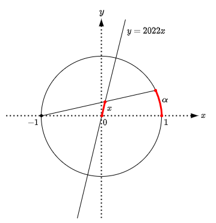

# TetCTF-2022 Intended Solutions

## shares

1. Keep requesting the shares until all padded elements can be eliminated from a returned set (the coefficients
   associated with the padded elements together form a 16x16 singular matrix, probability: 1/37), then we have one (maybe
   more) linear combinations of the secret characters.
2. Collect 16 independent combinations to recover the characters.

## shares_v2

1. With each share, we
   have `(coeffs[0] * ffes[0] + coeffs[1] * ffes[1] + ... - coeffs[-1]) * (coeffs[0] * ffes[0] + coeffs[1] * ffes[1] + ... - (coeffs[-1] - P//2)) == 0`
   . Just expand the product.
2. Treat `ffes[i]**ffes[j]` as unknowns, just as `ffes[i]`.
3. Collect enough equations and solve for the unknowns.

## fault

1. Submit `c = -1` to recover `n` (probability: 1/2)
2. Let `d[i]`, `f[i]` be the bits of the secret decryption exponent `d` and a fault vector `f` in little-endian order.
   Let `v` denote the decryption result: `v = c**(d^f) % n`, we have `d^f = sum((d[i] + f[i] - 2*d[i]*f[i]) * 2**i)`.
   Let `A[i] = (1 - 2*f[i]) * 2**i`, `B[i] = f[i] * 2**i`, we have `sum(A[i] * d[i]) = d^f - sum(B[i])`, the goal is to
   recover each `d[i]`. To do this, treat `A = (A[0], A[1], ...)` as a vector, keep calling the oracle with a constant
   value, e.g. `c = 2`, until we have 128 linearly independent vectors `Aj`, then each `d[i]` can be represented as a
   linear combination of `d^fj - sum(Bj[i])` with fractional coefficients for which `m[i]` is the common denominator.
   Compute `c**(m[i]*d[i]) % n` (note that `c**(d^fj - sum(Bj[i])) = vj/c**sum(Bj[i])` are all known to us) to deduce
   each `d[i]`. Now `d` is recovered.
3. Submit `c = "c"` for a few times and obtain `f0`, `f1`, .... Compute `d0 = d^f0`, `d1 = d^f1`, ... Now we
   have `c0 = encrypted_flag**d0 % n`, `c1 = encrypted_flag**d1 % n`,... Use the extended GCD algorithm to find `m0`
   , `m1`, ... such that `m0*d0 + m1*d1 + ... == 1`. Compute `c = c0**m0 * c1**m1 * ... % n`. Now `c` is recovered.
4. Compute `c**d % n` to recover the flag.

## algebra

1. Find a relation between `x` and `alpha` in the following figure, we should
   have `x = sin(alpha/2) / sin(beta - alpha/2)` where `beta = arctan(2022)`.
   
2. Apply Euler's formula, we
   have `x = (E**(I*alpha/2) - E**(-I*alpha/2)) / (E**(I*(beta-alpha/2)) - E**(-I*(beta-alpha/2)))`, in
   which `I = sqrt(-1)` and `E` is the Euler number. Simplify the equation, we
   have `x = (e**(I*alpha) - 1)/(e**(I*beta) - e**(-I*beta)*e**(I*alpha))`.
3. Solve for `e**(I*alpha)` from `x`, we have `e**(I*alpha) = (1 + x*e**(I*beta)) / (1 + x*e**(-I*beta))`. This is a
   valid homomorphism which can be used to get the flag (note that `e**(I*beta)` can be derived
   from `tan(beta) == 2022`). Example code:
   ```python
   from sage.all import GF
   p = 50824208494214622675210983238467313009841434758617398532295301998201478298245257311594403096942992643947506323356996857413985105233960391416730079425326309
   Fp = GF(p)
   I = Fp(-1).sqrt()
   e__i_2_beta = (1 + 2022*I) / (1 - 2022*I)
   e__i_beta = e__i_2_beta.sqrt()

   def f(x):
       return (1 + x*e__i_beta) / (1 + x/e__i_beta)
   ```

- *Fun fact 1: the constant `C` is one of many possibilities of `cos(beta)`.*
- *Fun fact 2: the figure is part of a hint that had never been released.*
- *Fun fact 3: If I were not the author, I wouldn't be able to solve the challenge without the hint :D.*
